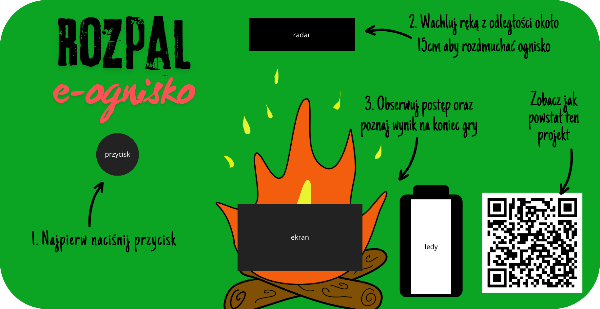

# Warsztaty z elektroniki

Szczegóły i mozliwość zapisu na zajęcia na stronie: [opole.zhr.pl/harclab](https://opole.zhr.pl/harclab/)

## Arduino - Gra Rozpal Ognisko

Gra polega na tym że wachlując ręką przed czujnikiem odległości symulujemy rozpalanie (rozdmuchiwanie) ogniska. 
Przycisk startuje i resetuje grę. Czujnik odległości mierzy tempo zmian odległości i wylicza tempo wachlowania. Im szybszy ruch tym łatwiej rozpalić. Przerwanie machania sprawia, że ognisko przygasa. 

Po osiągnięciu 100% odgrywany jest początek piosenki płonie ognisko oraz wyświetlany czas osiągnięty przez gracza. 

Moduł zapamiętuje najkrótszy czas ukończenia gry.


Kod źródłowy: [warsztaty_harcerskie.ino](warsztaty_harcerskie.ino)

### Części składowe zestawu

- Mikrokontroler: [ESP-WROOM-32](https://forbot.pl/blog/leksykon/esp32)
- Czujnik odległości: [Sharp GP2Y0A21YK0F](https://botland.com.pl/analogowe-czujniki-odleglosci/29-sharp-gp2y0a21yk0f-analogowy-czujnik-odleglosci-10-80cm-5904422304713.html)
- [10-cio segmentowy moduł LED](https://pl.aliexpress.com/item/1005007095450799.html)
- [Buzzer PCB](https://abc-rc.pl/pl/products/modul-buzzera-aktywnego-na-plytce-pcb-3-3v-5v-stan-wysoki-do-arduino-projektow-diy-i-robotyki-9715.html?gQT=1)
- [Wyświetlacz OLED niebieski graficzny 1,3'' 128x64px I2C](https://botland.com.pl/wyswietlacze-oled/8867-wyswietlacz-oled-niebieski-graficzny-13-128x64px-i2c-v2-niebieskie-znaki-sh1106-5903351241182.html)
- dowolny tact switch - przycisk zwierny

### Podłączenie układu

#### Moduł LED

- z jednej strony wszystkich pinów `GND`
- z drugiej strony najpierw rezystory 220Ohm, a następnie piny (w kolejności od koloru niebieskiego do czerwonego): `25, 26, 27, 14, 12, 13, 33, 32, 4, 2`

#### Czujnik odległości

- `GND`
- `VCC` -> `Vin` (mikrokontrolera) - tam jest napięcie 5V wymagane przez czujnik
- SensorPin -> `34`

#### Wyświetlacz OLED 1,3''

Magistrala I2C
- `GND`
- `VCC` -> `3v3`
- `SCL` -> `21`
- `SDA` -> `22`

#### Przycisk 

- z jednej strony `GND`
- z drugiej strony pin nr `15`

#### Buzzer

- `GND`
- `VCC` -> `3v3`
- `IN` -> pin nr `5`

### Okładka na pudełko

W moim przypadku zastosowałem opakowanie po Wykałaczko-nitkach firmy Polydent. Na opakowanie wydrukowałem własną etykietę oraz wywierciłem odpowiednie otwory




## Building pdfs for lessons

```bash
npm run build-pdf
```
