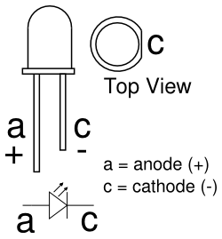
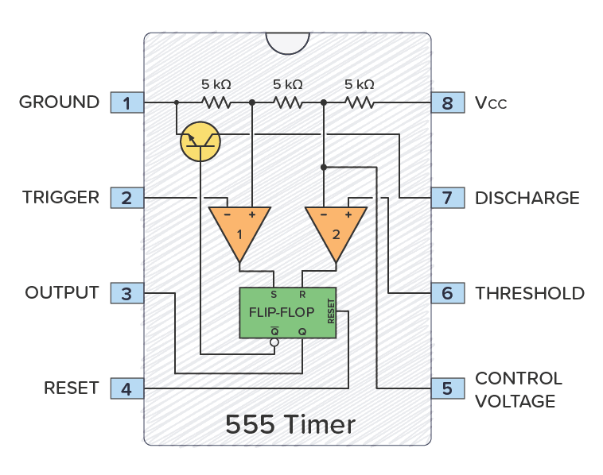
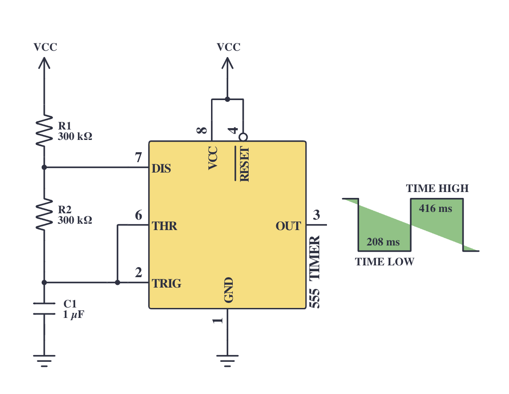
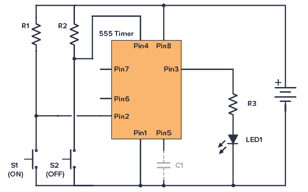
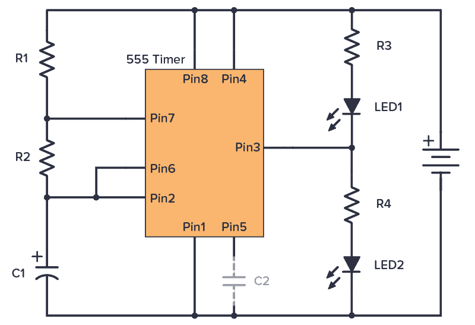

# 🔌 **Warsztaty Elektroniki: Pierwszy Krok w Elektronice na Płytce Stykowej**

## 🎯 Cel zajęć
Nauczyć się podstaw elektroniki poprzez budowę prostych obwodów na płytce stykowej oraz zrozumieć działanie kluczowych elementów, takich jak dioda LED, rezystor, przycisk, kondensator i układ NE555.

---

## 📋 Lista elementów potrzebnych do wykonania ćwiczeń

### 🔩 Podstawowe komponenty:
- **Płytka stykowa** (breadboard) – 1 szt.
- **Przewody połączeniowe** (męskie-męskie lub męskie-żeńskie) – kilka szt.
- **Źródło zasilania**: bateria 9V z uchwytem lub moduł zasilający 5V.

### ⚡ Komponenty elektroniczne:
- **Dioda LED** (czerwona lub inna) – minimum 1 szt.
- **Rezystory**: 220Ω i 1kΩ – po 1 szt. każdego rodzaju.
- **Przycisk (tact switch)** – 1 szt.
- **Układ scalony NE555** (opcjonalnie moduł gotowy do użycia) – 1 szt.
- **Kondensator 10µF** (opcjonalnie do NE555) – 1 szt.

---

## 💡 Ćwiczenie 1: Zapal diodę LED

> 📚 **Teoria: Dioda LED i Rezystor**  
> **Dioda LED** to element emitujący światło, posiadający dwie nóżki:
> - **Anoda (+)** – podłączana do dodatniego bieguna zasilania.
> - **Katoda (-)** – podłączana do masy (GND).
>
> **Rezystor** ogranicza przepływ prądu, chroniąc diodę LED przed przepaleniem. Wartość (np. 220Ω) jest dobrana tak, aby prąd mieścił się w bezpiecznym zakresie. ⚡



### Schemat połączenia
Bateria (lub moduł zasilający) → rezystor (220Ω) → dioda LED → masa

### Instrukcja:
➡️ Wybierz rząd otworów na płytce stykowej.  
➡️ Podłącz anodę diody LED do jednego końca rezystora (220Ω).  
➡️ Połącz drugi koniec rezystora z dodatnim biegunem źródła zasilania.  
➡️ Podłącz katodę diody LED do masy.  
➡️ Podłącz źródło zasilania.

⚠️ *Jeśli LED nie świeci:*
- Sprawdź poprawność polaryzacji diody.
- Upewnij się, że wszystkie połączenia są solidne.

---

## 🖲️ Ćwiczenie 2: Włącz diodę przyciskiem

> 📚 **Teoria: Przycisk (Tact Switch)**  
> Przycisk działa jak przełącznik – po wciśnięciu zamyka obwód, umożliwiając przepływ prądu. Dzięki temu można sterować stanem diody LED, włączając ją tylko przy naciśnięciu. 👍

### Schemat połączenia
Bateria → rezystor (220Ω) → dioda LED → masa  
*(Przycisk umieszczony między dodatnim biegunem źródła zasilania a anodą diody LED)*

### Instrukcja:
➡️ Zmodyfikuj układ z Ćwiczenia 1, usuwając bezpośrednie połączenie między dodatnim biegunem zasilania a anodą diody.  
➡️ Wstaw przycisk pomiędzy źródło zasilania a anodę LED.  
➡️ Po naciśnięciu przycisku dioda LED powinna się zaświecić.

⚠️ *Jeśli LED nie świeci:*
- Sprawdź, czy przycisk działa poprawnie (przetestuj różne połączenia).
- Upewnij się, że przycisk i rezystor są umieszczone w odpowiednich miejscach.

---

## ⏱️ Ćwiczenie 3: Migająca dioda LED z NE555

> 📚 **Teoria: Układ NE555, Kondensator i Tryb Astabilny**  
> **Układ NE555** to uniwersalny timer, działający w trybach monostabilnym, astabilnym i bistabilnym. W tym ćwiczeniu wykorzystujemy tryb **astabilny**, w którym NE555 generuje ciągłe impulsy, powodując miganie diody LED.
>
> **Kluczowe elementy:**
> - **Kondensator (np. 10µF):** Ładuje się i rozładowuje, ustalając częstotliwość impulsów.
> - **Rezystory (np. 1kΩ):** Regulują czas ładowania/rozładowania kondensatora.
>
> **Działanie układu:**  
> 1️⃣ Kondensator ładuje się przez rezystory do osiągnięcia 2/3 napięcia zasilania.  
> 2️⃣ Po osiągnięciu tego progu, wewnętrzny komparator zmienia stan wyjścia (Pin 3), wyłączając diodę LED.  
> 3️⃣ Kondensator rozładowuje się aż do spadku poniżej 1/3 napięcia, co ponownie włącza LED.
>
> W efekcie powstaje cykliczny efekt migania, zależny od wartości użytych rezystorów i kondensatora. 🔄



### Schemat połączenia
```  
✔ **Pin 1 (GND):** masa  
✔ **Pin 2 (Trigger):** podłączony do masy przez kondensator 1µF  
✔ **Pin 3 (Output):** połączony z diodą LED przez rezystor 220Ω i do masy (katoda) 
✔ **Pin 4 (Reset):** podłączony do dodatniego bieguna zasilania  
✔ **Pin 5 (Control):** nie podłączony
✔ **Pin 6 (Threshold):** połączony z Pin 2  
✔ **Pin 7 (Discharge):** połączony z Pin 6 przez rezystor 300kΩ oraz do dodatniego bieguna przez rezustor 300kΩ
✔ **Pin 8 (VCC):** podłączony do dodatniego bieguna zasilania  
```



### Instrukcja:
➡️ Umieść układ NE555 na płytce stykowej.  
➡️ Podłącz piny zgodnie z powyższym schematem.  
➡️ Podłącz źródło zasilania i obserwuj miganie diody LED.

⚠️ *Jeśli LED nie miga:*
- Sprawdź dokładność wszystkich połączeń.
- Upewnij się, że wartości rezystorów i kondensatora są zgodne z założeniami.

---

## Zadania dodatkowe

1. **Regulacja częstotliwości przez zmianę kondensatora lub rezystorów**  
   Wymień kondensator w układzie NE555 i obserwuj, jak zmienia się częstotliwość migania diody LED. Przydatny może okazać się kalkulator: 
[https://www.build-electronic-circuits.com/circuit-calculator-conversion/555-timer-calculator/](https://www.build-electronic-circuits.com/circuit-calculator-conversion/555-timer-calculator/)


2. **Układ z dwoma przyciskami**  
   Zaprojektuj układ, w którym jeden przycisk włącza diodę LED, a drugi ją wyłącza.



- R1 -> 1kΩ
- R2 -> 1MΩ

3. **Światła policyjne**  
   Zaprojektuj układ z dwiema diodami, tak aby migały naprzemiennie.



- R1-R2: 1 kΩ
- R3, R4 - w zależności od diody
- C1: 1000 µF
